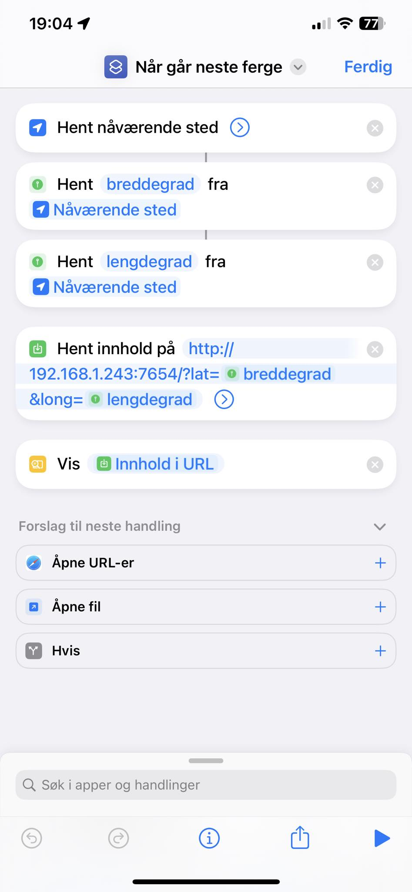

## Introduction

This project is a fork of Joachim's original work. Kudos to Joachim for laying the foundation! I've made some modifications to suit my needs. 

* Vercel serverless
* ferge.chrorvik.dev

Orginal text: 

Script to fetch ferry schedule from FramMR.no and send the response to Siri from Shortcuts:

